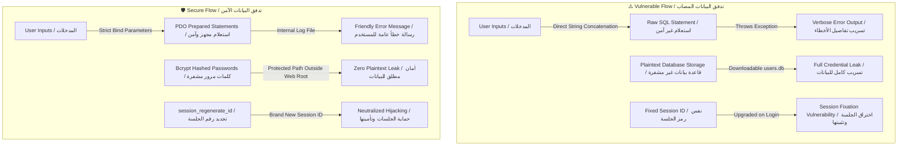

# 🛡️ WolfLab - Security Audit & Vulnerability Report
## تقرير المراجعة الأمنية وتحليل الثغرات لـ WolfLab

This document provides a comprehensive security audit of the **WolfLab** educational penetration testing laboratory. It details the five major security vulnerabilities present in the repository, their exploitation vectors, impact, and secure coding remediation strategies.

هذا المستند يقدم مراجعة أمنية شاملة لمختبر الاختراق التعليمي **WolfLab**. يوضح هذا التقرير الثغرات الأمنية الخمس الرئيسية الموجودة في المشروع، وطرق استغلالها، وتأثيرها، مع تقديم الحلول البرمجية الآمنة لسد هذه الثغرات.

---

## 🗂️ Table of Contents / الفهرس
1. [Vulnerability 1: SQL Injection (SQLi) Bypass / حقن الاستعلامات وتخطي المصادقة](#vulnerability-1-sql-injection-sqli-bypass)
2. [Vulnerability 2: Sensitive Information Exposure (Verbose Errors) / تسريب البيانات عبر الأخطاء التفصيلية](#vulnerability-2-sensitive-information-exposure-verbose-errors)
3. [Vulnerability 3: Direct Web Access to Database File (`users.db`) / الوصول المباشر لملف قاعدة البيانات](#vulnerability-3-direct-web-access-to-database-file-usersdb)
4. [Vulnerability 4: Plaintext Password Storage (Weak Hashing) / تخزين كلمات المرور بنص صريح](#vulnerability-4-plaintext-password-storage-weak-hashing)
5. [Vulnerability 5: Insecure Session Management (Session Fixation) / ضعف إدارة الجلسات وتثبيتها](#vulnerability-5-insecure-session-management-session-fixation)
6. [Summary and Best Practices / ملخص وأفضل الممارسات](#summary-and-best-practices)

---

## Vulnerability 1: SQL Injection (SQLi) Bypass
### 1. ثغرة حقن قواعد البيانات وتخطي المصادقة (SQL Injection)

| Attribute / الخاصية | Details / التفاصيل |
| :--- | :--- |
| **Severity / الخطورة** | 🔴 Critical / حرجة جداً |
| **Affected File / الملف المصاب** | [`login.php`](file:///c:/Users/Gouda/Desktop/lab-pentesting/login.php) (Line 35) |
| **Vulnerability Type / نوع الثغرة** | OWASP A03:2021-Injection |

#### 🔍 Vulnerable Code / الكود المصاب
```php
// Direct string interpolation into raw SQL without sanitization or prepared statements.
$query = "SELECT * FROM users WHERE username = '$username' AND password = '$password'";
```

#### 🛠️ Exploit Scenario & Mechanism / سيناريو وكيفية الاستغلال
* **The Concept**: The application accepts the `$username` and `$password` parameters directly from user input via the `POST` request and injects them straight into the SQL query string.
* **The Payload**: 
  ```sql
  ' OR 1=1-- -
  ```
* **Database Execution Flow**:
  When this payload is submitted as the username, the database engine constructs the following SQL command:
  ```sql
  SELECT * FROM users WHERE username = '' OR 1=1-- -' AND password = '$password'
  ```
* **Why it works**:
  1. The single quote (`'`) closes the string literal for the username.
  2. The `OR 1=1` statement is always evaluated as **True**.
  3. The `--` starts a comment in SQLite (the trailing space and dash `-` are standard delimiters to ensure trailing quotes are completely ignored).
  4. This structure bypasses the password condition completely. Since the condition `OR 1=1` is true, the database returns the very first entry in the `users` table, which represents the Administrator account (`admin`).

---

#### 🛡️ Secure Coding Remediation / الحل البرمجي الآمن
To completely eliminate SQL Injection, **Prepared Statements (Parameterized Queries)** must be used. In PHP, this is implemented using **PDO**:

```php
// Secure Implementation using Prepared Statements
$query = "SELECT * FROM users WHERE username = :username";
$stmt = $db->prepare($query);
$stmt->execute([
    ':username' => $username
]);
$user = $stmt->fetch(PDO::FETCH_ASSOC);

// Note: Password verification is decoupled from SQL syntax (explained in Vuln 4)
if ($user && password_verify($password, $user['password'])) {
    // Login Successful
}
```
* **Why it works**: In a prepared statement, the database engine compiles the SQL query structure *before* inserting the user inputs. The inputs are strictly treated as parameters (data), not executable SQL instructions, which completely neutralizes any SQL syntax manipulation.

---

## Vulnerability 2: Sensitive Information Exposure (Verbose Errors)
### 2. تسريب البيانات الحساسة عبر الأخطاء التفصيلية (Verbose SQL Errors)

| Attribute / الخاصية | Details / التفاصيل |
| :--- | :--- |
| **Severity / الخطورة** | 🟡 Medium / متوسطة |
| **Affected File / الملف المصاب** | [`login.php`](file:///c:/Users/Gouda/Desktop/lab-pentesting/login.php) (Lines 53-56) |
| **Vulnerability Type / نوع الثغرة** | OWASP A05:2021-Security Misconfiguration |

#### 🔍 Vulnerable Code / الكود المصاب
```php
} catch (PDOException $e) {
    // Exposing raw SQL error messages directly to the client
    $error_message = "Database Error: " . $e->getMessage() . "<br><br><strong>Executed Query:</strong><br><code style='color:#00f2fe;'>" . htmlspecialchars($sql_query_executed) . "</code>";
}
```

#### 🛠️ Exploit Scenario & Mechanism / سيناريو وكيفية الاستغلال
* **The Concept**: The developer set PDO to throw exceptions (`PDO::ERRMODE_EXCEPTION`) and then caught the exception to print `getMessage()` along with the full `$sql_query_executed` text to the front-end interface when an error occurs.
* **The Impact**: 
  1. An attacker can input mismatched quotes (e.g. `'` or `"` or mismatched brackets) to purposely trigger database syntax errors.
  2. The application will return detailed SQLite errors containing database driver names, internal column names, table names, and the exact query structure.
  3. This feedback loop makes it extremely easy for attackers to carry out **Error-Based SQL Injection** to extract database schemas and perform data exfiltration.

---

#### 🛡️ Secure Coding Remediation / الحل البرمجي الآمن
In production environments, detailed technical errors must never be shown to the client. Instead:
1. Log detailed exceptions internally into secure server log files.
2. Return a generic, user-friendly, non-descriptive error message to the client.

```php
} catch (PDOException $e) {
    // 1. Log the full detailed error locally for developers to inspect
    error_log("Database Error: " . $e->getMessage() . " | Executed Query: " . $sql_query_executed);

    // 2. Display a generic message to the user
    $error_message = "System error occurred. Please contact the administrator if this problem persists.";
}
```

---

## Vulnerability 3: Direct Web Access to Database File (`users.db`)
### 3. الوصول المباشر لملف قاعدة البيانات (Direct Database File Access)

| Attribute / الخاصية | Details / التفاصيل |
| :--- | :--- |
| **Severity / الخطورة** | 🟠 High / عالية |
| **Affected Location / المكان المتأثر** | Root Web Directory / المجلد الرئيسي للمشروع |
| **Vulnerability Type / نوع الثغرة** | OWASP A01:2021-Broken Access Control |

#### 🔍 Vulnerable Setup / الإعداد المصاب
Inside [`login.php`](file:///c:/Users/Gouda/Desktop/lab-pentesting/login.php) and [`init_db.php`](file:///c:/Users/Gouda/Desktop/lab-pentesting/init_db.php):
```php
$db_file = __DIR__ . '/users.db';
```
Since the PHP built-in server is executed at the root of `lab-pentesting/` with `php -S 0.0.0.0:8000`, the file `users.db` is directly in the root directory that is exposed to the internet.

#### 🛠️ Exploit Scenario & Mechanism / سيناريو وكيفية الاستغلال
* **The Concept**: SQLite is a file-based database. Unlike centralized engines (like MySQL), SQLite stores the entire database (schema, tables, rows, indexes) in a single local file.
* **The Attack**:
  An attacker can bypass the login panel completely and directly download the database file by issuing a standard HTTP request in their browser or via curl:
  ```bash
  curl -O http://localhost:8000/users.db
  ```
* **The Consequence**: The attacker obtains the entire database structure, all user credentials, and session tables immediately.

---

#### 🛡️ Secure Coding Remediation / الحل البرمجي الآمن
1. **Move Database Outside Web Root (Highly Recommended)**:
   The best practice is to place your database files in a directory that is *above* the web server's public document root (e.g., `/var/www/data/users.db` while the public web files are in `/var/www/html/`).
   
2. **Server-Side Request Blocking**:
   If the database must remain in the directory, restrict access through web server configurations.
   * For **Apache** (using `.htaccess`):
     ```apache
     <Files "users.db">
         Order Allow,Deny
         Deny from all
     </Files>
     ```
   * For **Nginx**:
     ```nginx
     location ~ \.db$ {
         deny all;
     }
     ```

---

## Vulnerability 4: Plaintext Password Storage (Weak Hashing)
### 4. تخزين كلمات المرور بنص صريح (Plaintext Passwords)

| Attribute / الخاصية | Details / التفاصيل |
| :--- | :--- |
| **Severity / الخطورة** | 🟠 High / عالية |
| **Affected File / الملف المصاب** | [`init_db.php`](file:///c:/Users/Gouda/Desktop/lab-pentesting/init_db.php) (Lines 42-54) |
| **Vulnerability Type / نوع الثغرة** | OWASP A02:2021-Cryptographic Failures |

#### 🔍 Vulnerable Code / الكود المصاب
```php
// Plaintext insertion inside init_db.php
$stmt->execute([
    ':username' => 'admin',
    ':password' => '123456',
    ':role' => 'administrator'
]);
```

#### 🛠️ Exploit Scenario & Mechanism / سيناريو وكيفية الاستغلال
* **The Concept**: The application inserts raw, plain-text passwords into the database during initialization. When checking credentials at login, it matches the user-provided password using direct string comparison.
* **The Danger**: If the database is compromised via **SQL Injection** (data extraction) or **Direct Web Access (Vulnerability 3)**, the attacker instantly gains the plain-text passwords of all registered users without needing to perform any decryption, hashing cracking, or brute-forcing.

---

#### 🛡️ Secure Coding Remediation / الحل البرمجي الآمن
1. **Cryptographic Hashing**: Never store raw passwords. Use PHP's built-in `password_hash()` which uses **bcrypt** by default, automatically generating secure cryptographic salts for each user.
2. **Safe Hashing in Database Initializer (`init_db.php`)**:
   ```php
   // Hash passwords before storing
   $admin_hashed = password_hash('123456', PASSWORD_BCRYPT);
   $guest_hashed = password_hash('guest123', PASSWORD_BCRYPT);

   $stmt = $db->prepare("INSERT OR IGNORE INTO users (username, password, role) VALUES (:username, :password, :role)");
   $stmt->execute([
       ':username' => 'admin',
       ':password' => $admin_hashed,
       ':role' => 'administrator'
   ]);
   ```
3. **Safe Verification during Authentication (`login.php`)**:
   ```php
   // 1. Fetch user by username only using Prepared Statement
   $stmt = $db->prepare("SELECT * FROM users WHERE username = :username");
   $stmt->execute([':username' => $username]);
   $user = $stmt->fetch(PDO::FETCH_ASSOC);

   // 2. Safely verify password using constant-time hashing comparison
   if ($user && password_verify($password, $user['password'])) {
       // Login success - establish session
   }
   ```

---

## Vulnerability 5: Insecure Session Management (Session Fixation)
### 5. ضعف إدارة الجلسات وتثبيتها (Insecure Session Management & Session Fixation)

| Attribute / الخاصية | Details / التفاصيل |
| :--- | :--- |
| **Severity / الخطورة** | 🟡 Medium / متوسطة |
| **Affected Files / الملفات المصابة** | [`login.php`](file:///c:/Users/Gouda/Desktop/lab-pentesting/login.php) & [`dashboard.php`](file:///c:/Users/Gouda/Desktop/lab-pentesting/dashboard.php) |
| **Vulnerability Type / نوع الثغرة** | OWASP A07:2021-Identification and Authentication Failures |

#### 🔍 Vulnerable Code / الكود المصاب
In `login.php` (after successful validation):
```php
$_SESSION['authenticated'] = true;
$_SESSION['username'] = $user['username'];
$_SESSION['role'] = $user['role'];
```

#### 🛠️ Exploit Scenario & Mechanism / سيناريو وكيفية الاستغلال
* **The Concept**: When a user goes from an guest/unauthenticated state to an authenticated state, the application continues to use the *same* Session ID (`PHPSESSID` cookie) that was initiated before logging in.
* **Session Fixation**:
  1. An attacker visits the website and gets assigned a valid session cookie `PHPSESSID=attacker_session_123`.
  2. The attacker tricks a victim into visiting the login page with that fixed session ID attached (e.g. `http://localhost:8000/login.php?PHPSESSID=attacker_session_123` or by setting it via XSS/cookie injection).
  3. The victim logs in using their credentials.
  4. Because the application does not change the Session ID upon authentication, `attacker_session_123` is now upgraded to an **authenticated** session.
  5. The attacker, using the cookie `PHPSESSID=attacker_session_123` in their own browser, gains direct authenticated access to the victim's dashboard without ever knowing the password.
* **Weak Cookie Attributes**: Standard session cookies without `HttpOnly`, `Secure`, and `SameSite` flags can be stolen via XSS (`document.cookie`) or sent over insecure channels.

---

#### 🛡️ Secure Coding Remediation / الحل البرمجي الآمن
1. **Regenerate Session ID on Authentication**: Always call `session_regenerate_id(true)` immediately after confirming the credentials. This destroys the old session ID and issues a brand new, random one, rendering the fixed ID useless.
2. **Secure Session Settings**: Force secure cookie parameters globally in PHP before starting the session.

```php
// Secure Session Start (Put at the top of login.php and dashboard.php)
session_start([
    'cookie_lifetime' => 0,              // Cookie expires when browser closes
    'cookie_path' => '/',
    'cookie_secure' => true,             // Transmit only over HTTPS (set to false for local HTTP labs, but true in production)
    'cookie_httponly' => true,           // Block Javascript access (Mitigates XSS cookie stealing)
    'cookie_samesite' => 'Lax'           // Protect against CSRF
]);

// Inside login.php (upon successful credential match):
session_regenerate_id(true);             // Regenerate session ID to prevent Session Fixation
$_SESSION['authenticated'] = true;
$_SESSION['username'] = $user['username'];
$_SESSION['role'] = $user['role'];
```

---

## Summary and Best Practices
## ملخص وأفضل الممارسات الأمنية للمطورين

To ensure the web application is secure, the developer must adhere to defensive secure coding patterns. The following diagram maps the transition from Vulnerable architecture to Secure architecture:

لتأمين تطبيقات الويب بشكل فعال، يجب على المطورين تبني أنماط كتابة الكود البرمجي الآمن والدفاعي. يوضح الرسم البياني التالي الفروقات الهيكلية وكيفية الانتقال من البيئة الضعيفة إلى البيئة الآمنة:



By transitioning the codebase to follow the **Secure Flow**, we successfully eliminate the core OWASP Top 10 vulnerabilities present in the project.

من خلال تطبيق **التدفق الآمن (Secure Flow)**، يمكننا حماية البرنامج بالكامل وإغلاق كافة ثغرات الـ OWASP Top 10 المذكورة في هذا المختبر التعليمي بنجاح.

---
*Report compiled by Antigravity AI Security Systems.*
